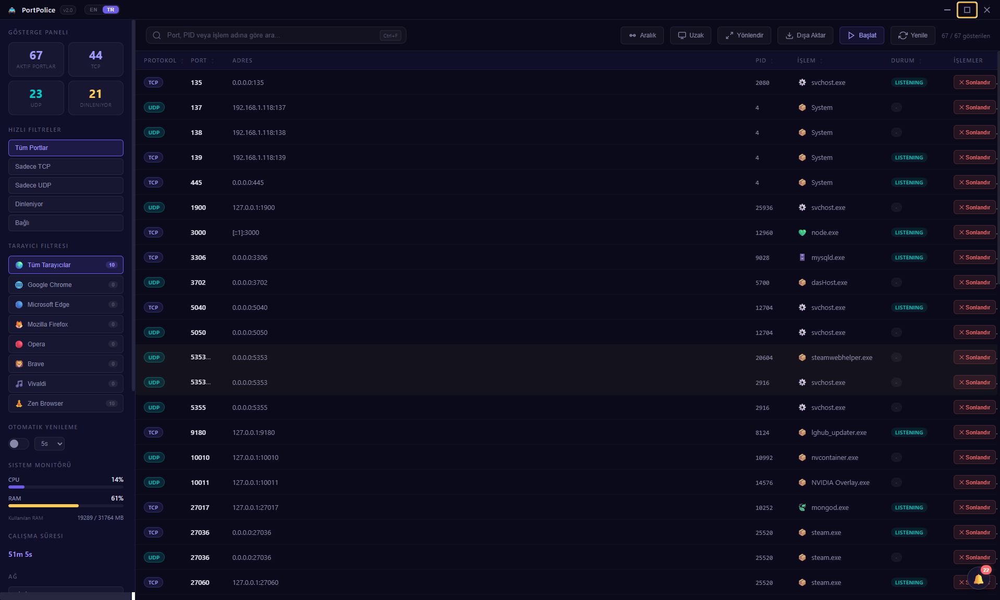
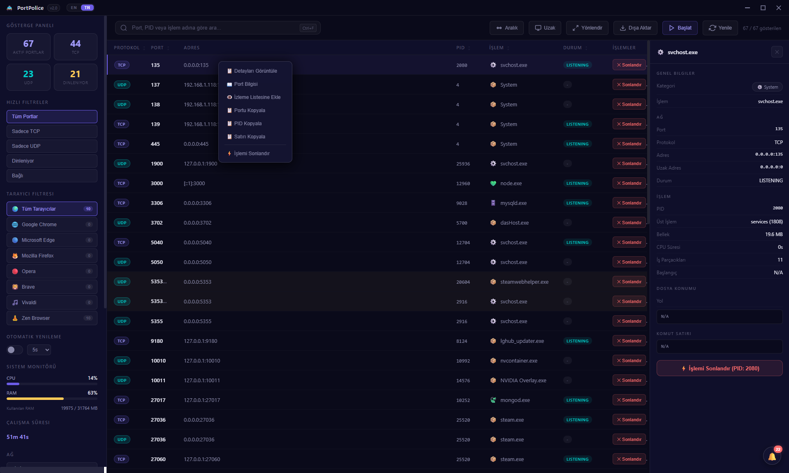
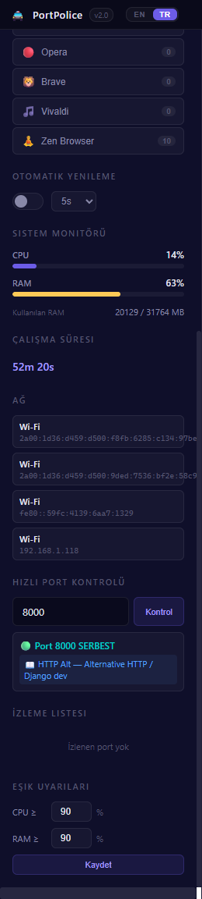
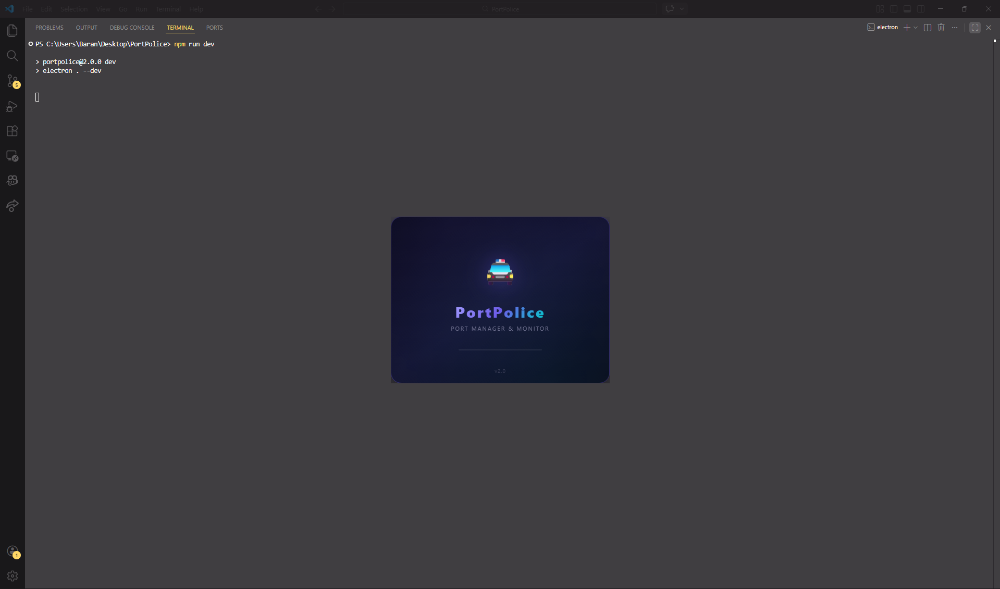

<div align="center">

# 🚔 PortPolice v2.0


<br/>


<br/>

**The most powerful desktop port manager you'll ever need.**
**Monitor, manage, scan, forward and kill network ports — all from one beautiful interface.**

**İhtiyacınız olan en güçlü masaüstü port yöneticisi.**
**Ağ portlarını izleyin, yönetin, tarayın, yönlendirin ve sonlandırın — tek bir arayüzden.**

<br/>

[🇬🇧 English](#-english) · [🇹🇷 Türkçe](#-türkçe)

<br/>

---

</div>

<!-- 
  ┌─────────────────────────────────────────────────────┐
  │  📸 SCREENSHOTS / EKRAN GÖRÜNTÜLERİ                │
  │                                                     │
  │  Add your screenshots to the assets/ folder and     │
  │  update the paths below.                            │
  │                                                     │
  │  Ekran görüntülerini assets/ klasörüne ekleyin      │
  │  ve aşağıdaki yolları güncelleyin.                  │
  └─────────────────────────────────────────────────────┘
-->

<div align="center">

### 📸 Screenshots / Ekran Görüntüleri


<p><em>Main Interface — Port listing with glassmorphism dark theme / Ana Arayüz — Glassmorphism karanlık tema ile port listesi</em></p>

<br/>


<p><em>Process Detail Panel — Deep dive into any process / İşlem Detay Paneli — Herhangi bir işlemin detaylarına dalın</em></p>

<br/>


<p><em>Sidebar — Dashboard, filters, system monitor, watchlist / Yan Panel — Gösterge paneli, filtreler, sistem monitörü, izleme listesi</em></p>

<br/>


<p><em>Splash Screen — Animated loading screen / Açılış Ekranı — Animasyonlu yükleme ekranı</em></p>

</div>

---

## 🇬🇧 English

### 🎯 What is PortPolice?

**PortPolice** is a professional-grade desktop application built with **Electron.js** that gives you complete control over your system's network ports. Think of it as a **Task Manager, but specifically designed for network ports** — with a modern glassmorphism UI, real-time monitoring, and powerful tools that developers, system administrators, and power users will love.

Whether you're a developer whose port 3000 is always "already in use", a sysadmin monitoring server connections, or someone who wants to understand what's happening on their network — **PortPolice has you covered.**

---

### ✨ Features Overview

#### 🔍 Core Port Management
| Feature | Description |
|---------|-------------|
| 📋 **Real-Time Port Listing** | View all active TCP & UDP ports with PID, process name, protocol, state, and local/foreign addresses |
| ⚡ **Smart Kill System** | Kill processes by PID or by port — finds & terminates ALL processes on a port, then verifies the port is freed |
| 🔎 **Powerful Search** | Instant search across port numbers, PIDs, process names, protocols, states, categories |
| 🎛️ **Quick Filters** | One-click filters: All Ports, TCP Only, UDP Only, Listening, Established |
| 🌐 **Browser Filter** | Dedicated filter for browser processes — Chrome, Edge, Firefox, Opera, Brave, Vivaldi, Zen |
| 📊 **Live Dashboard** | Real-time statistics: total ports, TCP count, UDP count, listening count |
| 🔄 **Auto Refresh** | Configurable auto-refresh at 3s, 5s, 10s, or 30s intervals |
| 📄 **Pagination** | Handle hundreds of ports with smooth pagination (10, 25, 50, 100, All per page) |

#### 🛡️ Advanced Scanning & Security
| Feature | Description |
|---------|-------------|
| 🎯 **Quick Port Check** | Instantly check if any port (1-65535) is in use or free |
| 📡 **Port Range Scan** | Scan a custom port range on localhost to find all active ports |
| 🌍 **Remote Host Scan** | TCP connect scan on any remote host/IP — find open ports remotely |
| 🚨 **Suspicious Port Detection** | Automatic alerts for known trojan/malware ports (NetBus, Back Orifice, Metasploit, etc.) |
| ⚠️ **Duplicate Port Warnings** | Detects when multiple processes listen on the same port |
| 👁️ **Watchlist** | Monitor specific ports — get notified when they go active or inactive |
| 📖 **Known Port Database** | Built-in database of 60+ well-known ports with service names, descriptions, and risk levels |

#### 🔀 Network Tools
| Feature | Description |
|---------|-------------|
| 🔀 **Port Forwarding** | Add/remove port forwarding rules directly from the app (requires Administrator) |
| 📈 **System Monitor** | Real-time CPU & RAM usage with animated progress bars |
| ⏱️ **Uptime Display** | System uptime shown in days, hours, minutes, seconds |
| 🌐 **Network Interfaces** | View your network interfaces and IP addresses |
| 🔔 **Port Change Notifications** | Real-time alerts when ports open or close — never miss a change |
| 📋 **Threshold Alerts** | Set CPU & RAM thresholds — get warned before your system overloads |

#### 🚀 Developer Tools
| Feature | Description |
|---------|-------------|
| 🚀 **Quick Launch** | Launch dev servers (npm, yarn, pnpm, node, python) directly from PortPolice with custom port injection |
| 📂 **Workspace Profiles** | Create reusable profiles with multiple services — start your entire stack with one click |
| 🎯 **Smart Port Injection** | Automatically injects port flags for Vite (`--port`), Next.js (`-p`), and `PORT` env variable |
| 📤 **Export Data** | Export port data as CSV or JSON for analysis or documentation |

#### 🎨 User Experience
| Feature | Description |
|---------|-------------|
| 🌙 **Glassmorphism Dark Theme** | Stunning dark UI with glass effects, glows, and smooth animations |
| 🖥️ **Custom Titlebar** | Frameless window with custom minimize/maximize/close controls |
| 🚔 **Animated Splash Screen** | Beautiful loading screen with gradient animation |
| 🌍 **Bilingual (EN/TR)** | Full English & Turkish language support — switch instantly |
| ⌨️ **Keyboard Shortcuts** | Full keyboard navigation for power users |
| 🖱️ **Right-Click Context Menu** | View details, port info, add to watchlist, copy data, kill — all from context menu |
| 🔀 **Draggable Columns** | Reorder table columns by drag & drop |
| 📱 **Process Detail Panel** | Click any port to see full process details: path, command line, memory, CPU, threads, parent process |

---

### ⌨️ Keyboard Shortcuts

| Shortcut | Action |
|----------|--------|
| `Ctrl + F` | Focus search bar |
| `Ctrl + R` | Refresh ports |
| `Ctrl + E` | Export menu |
| `Ctrl + L` | Quick Launch |
| `Ctrl + P` | Quick Port Check |
| `Ctrl + Shift + R` | Port Range Scan |
| `Ctrl + Shift + S` | Remote Host Scan |
| `?` | Show shortcuts help |
| `Esc` | Close modal / Clear search |

---

### 📦 Installation

#### Prerequisites
- [Node.js](https://nodejs.org/) (v18 or higher)
- [Git](https://git-scm.com/) (optional)

#### Steps

```bash
# Clone the repository
git clone https://github.com/Barand1500/PortPolice.git
cd PortPolice

# Install dependencies
npm install

# Run the application
npm start

# Run in development mode
npm run dev
```

---

### 🚀 Usage Guide

1. **Launch** the app — a splash screen appears, then all ports are scanned automatically
2. **Browse** the port table — see protocol, port, address, PID, process name, and state
3. **Search** with `Ctrl+F` — type any port number, PID, process name, or keyword
4. **Filter** using sidebar filters (TCP, UDP, Listening, Established) or browser-specific filters
5. **Click** any row to open the **detail panel** with full process information
6. **Right-click** any row for the **context menu** (details, port info, copy, watchlist, kill)
7. **Kill** a process — click the `✕ Kill` button, confirm in the modal, and the port is freed
8. **Quick Port Check** — type a port number in the sidebar to instantly check if it's in use
9. **Scan Ranges** — use the Range button to scan a port range on localhost
10. **Remote Scan** — scan open ports on any remote host or IP address
11. **Port Forward** — add/remove forwarding rules (run as Administrator)
12. **Quick Launch** — launch your dev servers with custom ports, create workspace profiles
13. **Watch ports** — add critical ports to your watchlist for monitoring
14. **Export** — save port data as CSV or JSON
15. **Monitor** — keep an eye on CPU, RAM, uptime, and network in the sidebar

---

### 🏗️ Project Structure & Architecture

```
PortPolice/
├── 📁 src/                         # Backend (Electron Main Process)
│   ├── main.js                     # App lifecycle, window management, all IPC handlers
│   ├── preload.js                  # Secure IPC bridge with contextBridge API
│   └── port-scanner.js             # Core engine: scanning, killing, system stats, port DB
├── 📁 ui/                          # Frontend (Renderer Process)
│   ├── index.html                  # Full UI structure — sidebar, table, modals, panels
│   ├── styles.css                  # 800+ lines of glassmorphism dark theme CSS
│   ├── renderer.js                 # All frontend logic, DOM manipulation, event handling
│   ├── i18n.js                     # Complete EN/TR translation system (200+ keys)
│   └── splash.html                 # Animated splash/loading screen
├── 📁 assets/                      # Static assets (icons, screenshots)
├── package.json                    # Project config, dependencies, scripts
└── README.md                       # This file
```

---

### 🛠️ Tech Stack

| Technology | Purpose |
|-----------|---------|
| **Electron.js v40+** | Cross-platform desktop framework — handles window, menus, system integration |
| **HTML5** | Semantic UI structure with modals, panels, and responsive layouts |
| **CSS3** | Glassmorphism design with `backdrop-filter`, CSS variables, animations, and transitions |
| **Vanilla JavaScript** | Zero dependencies frontend — pure JS for maximum performance, no React/Vue/Angular |
| **Node.js `child_process`** | Secure system command execution (`execFile` — no shell injection) |
| **Windows APIs** | `netstat -ano`, `tasklist`, `taskkill`, PowerShell `Get-Process`, `Get-CimInstance` |
| **contextBridge** | Secure IPC communication between renderer and main process |

---

### ⚙️ How It Works — Deep Dive

#### Architecture

```
┌─────────────────────┐          IPC (invoke/handle)          ┌──────────────────────┐
│   RENDERER PROCESS  │◄────────────────────────────────────►│   MAIN PROCESS       │
│                     │                                       │                      │
│  ┌───────────────┐  │    contextBridge.exposeInMainWorld    │  ┌────────────────┐  │
│  │ renderer.js   │  │◄─────────────────────────────────────►│  │ main.js        │  │
│  │ i18n.js       │  │         window.portPolice.*           │  │                │  │
│  │ index.html    │  │                                       │  │ IPC Handlers:  │  │
│  │ styles.css    │  │                                       │  │  scan-ports    │  │
│  └───────────────┘  │                                       │  │  kill-process  │  │
│                     │                                       │  │  check-port    │  │
│  UI Components:     │                                       │  │  scan-range    │  │
│  • Port Table       │                                       │  │  remote-scan   │  │
│  • Detail Panel     │                                       │  │  system-stats  │  │
│  • Sidebar          │                                       │  │  port-forward  │  │
│  • Modals           │                                       │  │  watchlist     │  │
│  • Toast System     │                                       │  │  export-data   │  │
│  • Context Menu     │                                       │  │  launch/stop   │  │
└─────────────────────┘                                       │  └────┬───────────┘  │
                                                              │       │              │
                                                              │  ┌────▼───────────┐  │
                                                              │  │ port-scanner.js │  │
                                                              │  │                 │  │
                                                              │  │ execFile():     │  │
                                                              │  │  netstat -ano   │  │
                                                              │  │  tasklist /CSV  │  │
                                                              │  │  taskkill /F    │  │
                                                              │  │  PowerShell     │  │
                                                              │  │  Stop-Process   │  │
                                                              │  │  Get-CimInstance│  │
                                                              │  └────────────────┘  │
                                                              └──────────────────────┘
```

#### Port Scanning Flow

```
1. User clicks Refresh / Auto-refresh triggers
         │
         ▼
2. renderer.js calls window.portPolice.scanPorts()
         │
         ▼
3. preload.js bridges to ipcRenderer.invoke('scan-ports')
         │
         ▼
4. main.js handles 'scan-ports' → calls scanPorts()
         │
         ▼
5. port-scanner.js executes netstat -ano via execFile()
         │
         ▼
6. Raw output is parsed line by line:
   • Extract protocol (TCP/UDP)
   • Extract local address & port
   • Extract foreign address
   • Extract state (LISTENING, ESTABLISHED, etc.)
   • Extract PID
         │
         ▼
7. Process names resolved via tasklist /FO CSV /NH
         │
         ▼
8. Each port enriched with:
   • App category (Browser, Runtime, Database, IDE, etc.)
   • App icon (emoji)
   • Display name
   • Known port info / Suspicious flag
         │
         ▼
9. Data sorted by port number and sent back to renderer
         │
         ▼
10. renderer.js detects changes (opened/closed ports)
    → Notifications triggered
    → Watchlist updated
    → Suspicious ports flagged
    → Table rendered with pagination
```

#### Kill Process Flow

```
1. User clicks Kill → Confirmation modal shown
         │
         ▼
2. On confirm → killPort(port, pid) called
         │
         ▼
3. Find ALL PIDs on that port (netstat -ano + regex match)
         │
         ▼
4. Kill each PID with taskkill /PID <pid> /T /F
         │
         ▼
5. Wait 500ms → Check if port is still active
         │
         ▼
6. If still active → Try PowerShell Stop-Process -Force
         │
         ▼
7. Final verification → Report results
   • Port freed ✅ → Success toast
   • Port still in use ⚠️ → Warning (may need Administrator)
   • Access denied ❌ → Error toast
```

---

### 🔐 Security

| Security Feature | Implementation |
|-----------------|----------------|
| **No Shell Injection** | Uses `execFile()` instead of `exec()` — arguments are passed as arrays, not concatenated strings |
| **Context Isolation** | Renderer has no direct access to Node.js — all communication through `contextBridge` |
| **Sandbox Mode** | Renderer runs in a sandboxed environment |
| **Content Security Policy** | CSP headers restrict inline scripts and external resources |
| **PID Validation** | All PIDs are parsed as integers and validated before use |
| **System Process Protection** | PID 0 and PID 4 (system-critical) cannot be killed |
| **Command Whitelist** | Quick Launch only allows: `npm`, `npx`, `yarn`, `pnpm`, `node`, `python`, `py`, `pip` |
| **Path Validation** | Folder paths are resolved to prevent directory traversal |
| **Input Sanitization** | All user-displayed text is HTML-escaped via `escapeHtml()` |

---

### ⚠️ Important Notes

- **Administrator privileges** may be required to kill system/service processes
- **System-critical processes** (PID 0, PID 4) are protected and cannot be killed
- **Port forwarding** requires running PortPolice as Administrator
- The app is currently **Windows-only** (uses `netstat`, `tasklist`, `taskkill`, PowerShell)
- Quick Launch commands are restricted to a whitelist of safe commands

---

## 🇹🇷 Türkçe

### 🎯 PortPolice Nedir?

**PortPolice**, **Electron.js** ile geliştirilmiş profesyonel seviyede bir masaüstü uygulamasıdır ve sisteminizin ağ portları üzerinde tam kontrol sağlar. Bunu **ağ portlarına özel tasarlanmış bir Görev Yöneticisi** olarak düşünün — modern glassmorphism arayüzü, gerçek zamanlı izleme ve geliştiricilerin, sistem yöneticilerinin ve ileri düzey kullanıcıların seveceği güçlü araçlarla.

Port 3000'i her zaman "zaten kullanımda" olan bir geliştirici olun, sunucu bağlantılarını izleyen bir sistem yöneticisi olun ya da ağında neler olduğunu anlamak isteyen biri olun — **PortPolice her durumda yanınızda.**

---

### ✨ Özellikler

#### 🔍 Temel Port Yönetimi
| Özellik | Açıklama |
|---------|----------|
| 📋 **Gerçek Zamanlı Port Listesi** | Tüm aktif TCP & UDP portlarını PID, işlem adı, protokol, durum ve adres bilgileriyle görüntüleyin |
| ⚡ **Akıllı Sonlandırma Sistemi** | İşlemleri PID veya port bazında sonlandırın — bir porttaki TÜM işlemleri bulur, sonlandırır ve portun serbest kaldığını doğrular |
| 🔎 **Güçlü Arama** | Port numarası, PID, işlem adı, protokol, durum ve kategorilerde anlık arama |
| 🎛️ **Hızlı Filtreler** | Tek tıkla filtreler: Tüm Portlar, Sadece TCP, Sadece UDP, Dinleniyor, Bağlı |
| 🌐 **Tarayıcı Filtresi** | Tarayıcılara özel filtre — Chrome, Edge, Firefox, Opera, Brave, Vivaldi, Zen |
| 📊 **Canlı Gösterge Paneli** | Gerçek zamanlı istatistikler: toplam port, TCP, UDP, dinleniyor sayıları |
| 🔄 **Otomatik Yenileme** | 3s, 5s, 10s veya 30s aralıklarla ayarlanabilir otomatik yenileme |
| 📄 **Sayfalama** | Yüzlerce portu akıcı sayfalama ile yönetin (sayfa başına 10, 25, 50, 100, Tümü) |

#### 🛡️ Gelişmiş Tarama & Güvenlik
| Özellik | Açıklama |
|---------|----------|
| 🎯 **Hızlı Port Kontrolü** | Herhangi bir portun (1-65535) kullanımda mı yoksa serbest mi olduğunu anında kontrol edin |
| 📡 **Port Aralığı Taraması** | Localhost üzerinde özel bir port aralığını tarayarak tüm aktif portları bulun |
| 🌍 **Uzak Bilgisayar Taraması** | Herhangi bir uzak host/IP üzerinde TCP bağlantı taraması — uzaktaki açık portları bulun |
| 🚨 **Şüpheli Port Tespiti** | Bilinen trojan/zararlı yazılım portları için otomatik uyarılar (NetBus, Back Orifice, Metasploit, vb.) |
| ⚠️ **Çift Port Uyarıları** | Aynı portta birden fazla işlemin dinlediğini tespit eder |
| 👁️ **İzleme Listesi** | Belirli portları izleyin — aktif veya pasif olduklarında bildirim alın |
| 📖 **Bilinen Port Veritabanı** | 60+ bilinen port için servis adları, açıklamalar ve risk seviyeleri içeren dahili veritabanı |

#### 🔀 Ağ Araçları
| Özellik | Açıklama |
|---------|----------|
| 🔀 **Port Yönlendirme** | Uygulama içinden port yönlendirme kuralları ekleyin/kaldırın (Yönetici gerektirir) |
| 📈 **Sistem Monitörü** | Animasyonlu ilerleme çubuklarıyla gerçek zamanlı CPU & RAM kullanımı |
| ⏱️ **Çalışma Süresi** | Sistem çalışma süresi gün, saat, dakika, saniye olarak gösterilir |
| 🌐 **Ağ Arayüzleri** | Ağ arayüzlerinizi ve IP adreslerinizi görüntüleyin |
| 🔔 **Port Değişiklik Bildirimleri** | Portlar açılıp kapandığında gerçek zamanlı uyarılar |
| 📋 **Eşik Uyarıları** | CPU & RAM eşikleri belirleyin — sisteminiz aşırı yüklenmeden önce uyarı alın |

#### 🚀 Geliştirici Araçları
| Özellik | Açıklama |
|---------|----------|
| 🚀 **Hızlı Başlatma** | Geliştirme sunucularını (npm, yarn, pnpm, node, python) özel port enjeksiyonu ile doğrudan PortPolice'den başlatın |
| 📂 **Çalışma Alanı Profilleri** | Birden fazla servis içeren yeniden kullanılabilir profiller oluşturun — tüm sisteminizi tek tıkla başlatın |
| 🎯 **Akıllı Port Enjeksiyonu** | Vite (`--port`), Next.js (`-p`) ve `PORT` ortam değişkeni için otomatik port bayrağı enjeksiyonu |
| 📤 **Veri Dışa Aktarma** | Port verilerini analiz veya dokümantasyon için CSV veya JSON olarak kaydedin |

#### 🎨 Kullanıcı Deneyimi
| Özellik | Açıklama |
|---------|----------|
| 🌙 **Glassmorphism Karanlık Tema** | Cam efektleri, parıltılar ve akıcı animasyonlarla çarpıcı karanlık arayüz |
| 🖥️ **Özel Başlık Çubuğu** | Çerçevesiz pencere, özel küçült/büyüt/kapat kontrolleri |
| 🚔 **Animasyonlu Açılış Ekranı** | Gradient animasyonlu güzel yükleme ekranı |
| 🌍 **İki Dilli (EN/TR)** | Tam İngilizce & Türkçe dil desteği — anında geçiş yapın |
| ⌨️ **Klavye Kısayolları** | İleri düzey kullanıcılar için tam klavye navigasyonu |
| 🖱️ **Sağ Tık Bağlam Menüsü** | Detay görüntüleme, port bilgisi, izleme listesi, kopyalama, sonlandırma — hepsi bağlam menüsünden |
| 🔀 **Sürüklenebilir Sütunlar** | Tablo sütunlarını sürükle & bırak ile yeniden sıralayın |
| 📱 **İşlem Detay Paneli** | Herhangi bir porta tıklayarak tam işlem detaylarını görün: yol, komut satırı, bellek, CPU, iş parçacıkları, üst işlem |

---

### ⌨️ Klavye Kısayolları

| Kısayol | İşlev |
|---------|-------|
| `Ctrl + F` | Arama çubuğuna odaklan |
| `Ctrl + R` | Portları yenile |
| `Ctrl + E` | Dışa aktarma menüsü |
| `Ctrl + L` | Hızlı Başlatma |
| `Ctrl + P` | Hızlı Port Kontrolü |
| `Ctrl + Shift + R` | Port Aralığı Taraması |
| `Ctrl + Shift + S` | Uzak Bilgisayar Taraması |
| `?` | Kısayollar yardımını göster |
| `Esc` | Modalı kapat / Aramayı temizle |

---

### 📦 Kurulum

#### Gereksinimler
- [Node.js](https://nodejs.org/) (v18 veya üzeri)
- [Git](https://git-scm.com/) (isteğe bağlı)

#### Adımlar

```bash
# Depoyu klonlayın
git clone https://github.com/Barand1500/PortPolice.git
cd PortPolice

# Bağımlılıkları yükleyin
npm install

# Uygulamayı çalıştırın
npm start

# Geliştirme modunda çalıştırın
npm run dev
```

---

### 🚀 Kullanım Kılavuzu

1. **Başlatın** — açılış ekranı görünür, ardından tüm portlar otomatik olarak taranır
2. **Göz atın** — protokol, port, adres, PID, işlem adı ve durumu görün
3. **Arayın** — `Ctrl+F` ile port numarası, PID, işlem adı veya anahtar kelime yazın
4. **Filtreleyin** — yan panel filtrelerini (TCP, UDP, Dinleniyor, Bağlı) veya tarayıcı filtrelerini kullanın
5. **Tıklayın** — herhangi bir satıra tıklayarak tam işlem bilgilerini içeren **detay panelini** açın
6. **Sağ tıklayın** — **bağlam menüsü** için (detaylar, port bilgisi, kopyalama, izleme listesi, sonlandırma)
7. **Sonlandırın** — `✕ Kill` butonuna tıklayın, modalda onaylayın ve port serbest bırakılsın
8. **Hızlı Port Kontrolü** — yan panelde bir port numarası yazarak anında kullanımda olup olmadığını kontrol edin
9. **Aralık Taraması** — Range butonu ile localhost üzerinde bir port aralığını tarayın
10. **Uzak Tarama** — herhangi bir uzak host veya IP adresinde açık portları tarayın
11. **Port Yönlendirme** — yönlendirme kuralları ekleyin/kaldırın (Yönetici olarak çalıştırın)
12. **Hızlı Başlatma** — özel portlarla geliştirme sunucularınızı başlatın, çalışma alanı profilleri oluşturun
13. **Portları izleyin** — kritik portları izleme listenize ekleyin
14. **Dışa aktarın** — port verilerini CSV veya JSON olarak kaydedin
15. **İzleyin** — yan panelde CPU, RAM, çalışma süresi ve ağ bilgilerini takip edin

---

### 🏗️ Proje Yapısı & Mimari

```
PortPolice/
├── 📁 src/                         # Backend (Electron Ana İşlem)
│   ├── main.js                     # Uygulama yaşam döngüsü, pencere yönetimi, tüm IPC handler'ları
│   ├── preload.js                  # contextBridge API ile güvenli IPC köprüsü
│   └── port-scanner.js             # Çekirdek motor: tarama, sonlandırma, sistem istatistikleri, port DB
├── 📁 ui/                          # Frontend (Renderer İşlem)
│   ├── index.html                  # Tam arayüz yapısı — yan panel, tablo, modallar, paneller
│   ├── styles.css                  # 800+ satır glassmorphism karanlık tema CSS
│   ├── renderer.js                 # Tüm ön yüz mantığı, DOM manipülasyonu, olay yönetimi
│   ├── i18n.js                     # Tam EN/TR çeviri sistemi (200+ anahtar)
│   └── splash.html                 # Animasyonlu açılış/yükleme ekranı
├── 📁 assets/                      # Statik dosyalar (simgeler, ekran görüntüleri)
├── package.json                    # Proje yapılandırması, bağımlılıklar, betikler
└── README.md                       # Bu dosya
```

---

### 🛠️ Teknoloji Yığını

| Teknoloji | Amaç |
|-----------|------|
| **Electron.js v40+** | Çapraz platform masaüstü çerçevesi — pencere, menü, sistem entegrasyonu |
| **HTML5** | Modallar, paneller ve duyarlı düzenlerle semantik arayüz yapısı |
| **CSS3** | `backdrop-filter`, CSS değişkenleri, animasyonlar ve geçişlerle glassmorphism tasarım |
| **Saf JavaScript** | Sıfır bağımlılıklı ön yüz — maksimum performans için saf JS, React/Vue/Angular yok |
| **Node.js `child_process`** | Güvenli sistem komutu çalıştırma (`execFile` — shell injection yok) |
| **Windows API'leri** | `netstat -ano`, `tasklist`, `taskkill`, PowerShell `Get-Process`, `Get-CimInstance` |
| **contextBridge** | Renderer ve ana işlem arasında güvenli IPC iletişimi |

---

### ⚙️ Nasıl Çalışır — Derinlemesine

#### Mimari

```
┌─────────────────────┐         IPC (invoke/handle)          ┌──────────────────────┐
│  RENDERER İŞLEMİ    │◄───────────────────────────────────►│   ANA İŞLEM          │
│                     │                                       │                      │
│  ┌───────────────┐  │   contextBridge.exposeInMainWorld    │  ┌────────────────┐  │
│  │ renderer.js   │  │◄────────────────────────────────────►│  │ main.js        │  │
│  │ i18n.js       │  │        window.portPolice.*           │  │                │  │
│  │ index.html    │  │                                       │  │ IPC İşleyiciler│  │
│  │ styles.css    │  │                                       │  │  scan-ports    │  │
│  └───────────────┘  │                                       │  │  kill-process  │  │
│                     │                                       │  │  check-port    │  │
│  Arayüz Bileşenleri:│                                       │  │  scan-range    │  │
│  • Port Tablosu     │                                       │  │  remote-scan   │  │
│  • Detay Paneli     │                                       │  │  system-stats  │  │
│  • Yan Panel        │                                       │  │  port-forward  │  │
│  • Modallar         │                                       │  │  watchlist     │  │
│  • Toast Sistemi    │                                       │  │  export-data   │  │
│  • Bağlam Menüsü    │                                       │  │  launch/stop   │  │
└─────────────────────┘                                       │  └────┬───────────┘  │
                                                              │       │              │
                                                              │  ┌────▼───────────┐  │
                                                              │  │ port-scanner.js │  │
                                                              │  │                 │  │
                                                              │  │ execFile():     │  │
                                                              │  │  netstat -ano   │  │
                                                              │  │  tasklist /CSV  │  │
                                                              │  │  taskkill /F    │  │
                                                              │  │  PowerShell     │  │
                                                              │  │  Stop-Process   │  │
                                                              │  │  Get-CimInstance│  │
                                                              │  └────────────────┘  │
                                                              └──────────────────────┘
```

#### Port Tarama Akışı

```
1. Kullanıcı Yenile'ye tıklar / Otomatik yenileme tetiklenir
         │
         ▼
2. renderer.js → window.portPolice.scanPorts() çağırır
         │
         ▼
3. preload.js → ipcRenderer.invoke('scan-ports') ile köprüler
         │
         ▼
4. main.js → 'scan-ports' işler → scanPorts() çağırır
         │
         ▼
5. port-scanner.js → execFile() ile netstat -ano çalıştırır
         │
         ▼
6. Ham çıktı satır satır ayrıştırılır:
   • Protokol çıkarılır (TCP/UDP)
   • Yerel adres & port çıkarılır
   • Uzak adres çıkarılır
   • Durum çıkarılır (LISTENING, ESTABLISHED, vb.)
   • PID çıkarılır
         │
         ▼
7. İşlem adları tasklist /FO CSV /NH ile çözümlenir
         │
         ▼
8. Her port zenginleştirilir:
   • Uygulama kategorisi (Tarayıcı, Runtime, Veritabanı, IDE, vb.)
   • Uygulama ikonu (emoji)
   • Görüntüleme adı
   • Bilinen port bilgisi / Şüpheli bayrak
         │
         ▼
9. Veri port numarasına göre sıralanır ve renderer'a gönderilir
         │
         ▼
10. renderer.js değişiklikleri tespit eder (açılan/kapanan portlar)
    → Bildirimler tetiklenir
    → İzleme listesi güncellenir
    → Şüpheli portlar işaretlenir
    → Tablo sayfalama ile render edilir
```

#### İşlem Sonlandırma Akışı

```
1. Kullanıcı Kill'e tıklar → Onay modalı gösterilir
         │
         ▼
2. Onaylanınca → killPort(port, pid) çağrılır
         │
         ▼
3. O porttaki TÜM PID'ler bulunur (netstat -ano + regex eşleşme)
         │
         ▼
4. Her PID taskkill /PID <pid> /T /F ile sonlandırılır
         │
         ▼
5. 500ms bekle → Portun hâlâ aktif olup olmadığı kontrol edilir
         │
         ▼
6. Hâlâ aktifse → PowerShell Stop-Process -Force denenir
         │
         ▼
7. Son doğrulama → Sonuçlar raporlanır
   • Port serbest ✅ → Başarı bildirimi
   • Port hâlâ kullanımda ⚠️ → Uyarı (Yönetici gerekebilir)
   • Erişim engellendi ❌ → Hata bildirimi
```

---

### 🔐 Güvenlik

| Güvenlik Özelliği | Uygulama |
|-------------------|----------|
| **Shell Injection Yok** | `exec()` yerine `execFile()` kullanılır — argümanlar dizi olarak geçirilir, string birleştirilmez |
| **Bağlam İzolasyonu** | Renderer'ın Node.js'e doğrudan erişimi yok — tüm iletişim `contextBridge` üzerinden |
| **Sandbox Modu** | Renderer korumalı bir ortamda çalışır |
| **İçerik Güvenliği Politikası** | CSP başlıkları satır içi scriptleri ve harici kaynakları kısıtlar |
| **PID Doğrulama** | Tüm PID'ler tamsayı olarak ayrıştırılır ve kullanımdan önce doğrulanır |
| **Sistem İşlemi Koruması** | PID 0 ve PID 4 (sistem kritik) sonlandırılamaz |
| **Komut Beyaz Listesi** | Hızlı Başlatma yalnızca şunlara izin verir: `npm`, `npx`, `yarn`, `pnpm`, `node`, `python`, `py`, `pip` |
| **Yol Doğrulama** | Dizin geçişini önlemek için klasör yolları çözümlenir |
| **Girdi Temizleme** | Kullanıcıya gösterilen tüm metinler `escapeHtml()` ile temizlenir |

---

### ⚠️ Önemli Notlar

- Sistem/servis işlemlerini sonlandırmak için **yönetici yetkileri** gerekebilir
- **Sistem kritik işlemler** (PID 0, PID 4) korunmaktadır ve sonlandırılamaz
- **Port yönlendirme** PortPolice'in Yönetici olarak çalıştırılmasını gerektirir
- Uygulama şu anda **yalnızca Windows** desteklidir (`netstat`, `tasklist`, `taskkill`, PowerShell kullanır)
- Hızlı Başlatma komutları güvenli komutların beyaz listesiyle sınırlıdır

---

<div align="center">

### 📄 License / Lisans

MIT License — see [LICENSE](LICENSE) for details.

MIT Lisansı — detaylar için [LICENSE](LICENSE) dosyasına bakın.

---

### 🌟 Star this project if you find it useful! / Faydalı bulduysanız yıldızlayın!

---

**Made with ❤️ by Baran**

</div>
